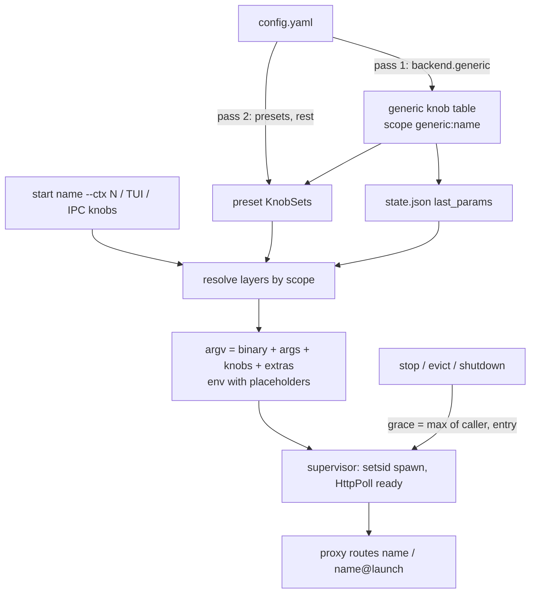
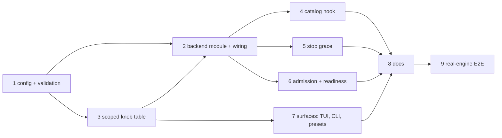

# feat: generic backend (run any OpenAI-compatible server)

**Status:** design settled 2026-09-26. Units 5 (launch/supervisor), 2 (daemon).
Commit subjects: `feat(unit5):` / `feat(unit2):`.

## Overview

Add a backend, id `generic`, that runs a user-declared binary as a model server
with the bare minimum lifecycle: start, readiness poll, proxy routing, stop. It
knows nothing about the engine. Everything engine-specific lives in the entry's
`args`, `env` and string knobs, or in a wrapper script the user writes.

Target engines, neither of which is `llama-server`-compatible:

- **gufo**: a native binary with its own CLI (`gufo serve --port N llm -m ...
  --speculative mtp --mtp-model ...`). Runs directly, no wrapper.
- **Halogen**: a closed-source Docker image configured by about 30 `HALOGEN_*`
  env vars. Runs through a wrapper script around `docker run`.

## Problem Frame

On 2026-09-26, Qwen3.8 Flash-Next was benchmarked on a 128 GB Strix Halo with
Pi-shaped coding prompts, 2 reps per cell. The 64k rows ran on stock
`performance`, the 256k row at 70 W, which measured the same.

| Cell | Halogen 0.14.0 | gufo `d9a84f1` | llama.cpp-unsloth b11160 |
|---|---|---|---|
| 64k window, 3-turn time @1k out | 114 s | 124 s | 224 s (Vulkan) / 285 s (ROCm) |
| 256k window, 50% full | 3.4 min | 4.0 min | not run |
| Prefill, 32k prompt | 1,045 t/s | 1,033 t/s | 314 t/s |

The two fastest engines can't be launched by LlamaStash today. Both expose
OpenAI-compatible `/v1/*` on a port, which is all the proxy needs.

### Incident this design must not repeat

During the benchmark, a GPU server that got two signals exited in the middle of
a kernel. That caused a gfxhub page fault and an MES hang, the GPU reset
failed, and the desktop froze until a hard reboot (CIRU's llama-server, kernel
7.2.7, gfx1151). A 5 s grace followed by SIGKILL can do the same to a
slow-stopping engine. For Docker, SIGKILL on the `docker run` CLI leaves the
container running and holding the GPU. So stop grace is per entry and nothing
may shorten it, and the wrapper contract turns SIGTERM into `docker stop`.

## Update 2026-09-26 (implementation)

Decisions taken with Deepu during implementation; they supersede the text below
where it disagrees.

- **`model` field.** An entry may set `model`: a preset-key glob, a path, or a
  model id over catalog GGUFs. With it, the entry is the server
  `generic-<name>` on each matching row (no row of its own); `{model}` carries
  the chosen GGUF path and must be referenced; `{name}` is the model's own id.
  llama.cpp stays the default; the entry runs when picked (TUI Server row,
  `--server`, preset `server:`), and last-used remembers the pick. Without
  `model`, the entry is its own `generic://<name>` row as planned. `model` only
  matches catalog GGUFs; non-GGUF engines use the model-less shape.
- **Documented, not enforced:** loopback binding, cleanup, multiple launches'
  ports / memory beyond `memory_gib`, and `--server` vs `model` agreement (only
  the TUI filters).
- **KTD7 dropped.** No daemon extras lift. `-- --flag v` passes to argv as
  before; knob values persist when set as knobs (TUI, presets, IPC `knobs`).
  The CLI tail parser resolves compiled-in knobs only.
- **No `start <entry-name>` shortcut** for a `model` entry.
- **KTD10 as built:** the grace floor rides `ProcessLaunchSpec.min_stop_grace`
  onto the supervised model, so every stop path honours it without a trait
  method; `status` rows carry `stop_grace_secs` and `shutdown` returns the
  longest, so CLI `stop` and `daemon stop` wait for it.
- **`memory_gib`** applies only without `model`; a `model` launch is priced from
  its GGUF like any other.
- **Unit 9 results** (gufo `d9a84f1`, Halogen `0.14.0`, CIRU `3cf984c`): all
  three start, serve through the proxy and stop cleanly. Halogen's readiness is
  `/v1/models`; it does not validate `model`; its `all` mode binds the API on
  `0.0.0.0` regardless of `HALOGEN_BIND`, so the wrapper publishes a bridge
  port on loopback instead of `--network host`.

## Requirements Trace

- R1. Launch a config-declared server with start, readiness, proxy routing,
  eviction and stop.
- R2. Presets and `last_params` work for generic entries.
- R3. Entries declare string knobs that work in the TUI editor, presets,
  `last_params`, `--json` and the CLI.
- R4. Multiple launches and named launches of one entry work.
- R5. A per-entry stop grace applies to every stop path and is never
  shortened.
- R6. Optional `memory_gib` feeds admission; unset means no gating.
- R7. Adding the backend keeps the backend-neutrality contract (AGENTS.md), and
  closes the existing Lemonade gap in `src/daemon/discovery_task.rs`.

## Scope Boundaries

- Not in v1:
  - running a catalog GGUF through an arbitrary binary (a `{model}` placeholder)
  - typed knobs (other than the `ctx: true` knob, see KTD6), choice rings, `auto`
  - bare flags with no value (put them in `args`)
  - top-level `start --<flag>` for config knobs
  - live reload of entries or knob declarations without a restart
  - RSS/GTT sampling to check `memory_gib`
  - proxy rewriting of the request's `model` field
  - orphan adoption after a daemon crash
  - log-based telemetry, knobs derived from `--help`, Windows service wrappers
- Not a replacement for dedicated backends. A gufo backend in the ds4 style,
  with arch routing and typed knobs, still makes sense later.

## Config

Config-only on purpose: `binary` is arbitrary execution. An IPC method or CLI
flag that sets one would be remote code execution for anyone holding the LAN
bearer key. The trust level stays the same as editing `config.yaml`.

```yaml
backend:
  generic:
    servers:
      - name: flash-next-gufo              # published on /v1/models
        binary: /mnt/work/Workspace/llms/gufo/build/release-gcc15/gufo
        # knobs, then launch extras, are appended after these args
        args: [serve, --host, "{host}", --port, "{port}", llm,
               --served-model-name, "{name}",
               -m, /path/to/Qwen3.8-Flash-Next-UD-Q4_K_XL-00001-of-00004.gguf,
               --mtp-model, /path/to/mtp-shared-Q8_0.gguf,
               --top-p, "0.95", --top-k, "20"]
        knobs:
          - flag: --context
            ctx: true                      # binds to --ctx and the TUI Context row
            default: "262144"
          - flag: --speculative
            default: mtp
          - flag: -t
            id: temperature                # `t` is a built-in alias (threads)
            default: "1.0"
          - --seed                         # shorthand for {flag: --seed}; unset = not emitted
        ready: /ready                      # gufo: 503 until the model is loaded
        memory_gib: 95
        stop_grace_secs: 60
      - name: flash-next-halogen
        binary: ~/bin/halogen-serve.sh
        args: ["{port}"]
        knobs:
          - flag: --ctx-window             # never emitted: referenced in env
            id: halogen-ctx
            ctx: true
            default: "65536"
          - flag: --temperature
            default: "1.0"
        env:
          HALOGEN_CTX: "{halogen-ctx}"
          HALOGEN_KV_POOL_POSITIONS: "{halogen-ctx}"
          HALOGEN_TEMPERATURE: "{temperature}"
        ready: /v1/models                  # to confirm in Unit 9
        memory_gib: 100
        stop_grace_secs: 90
        ready_timeout_secs: 600
```

Entry fields:

| Field | Required | Meaning |
|---|---|---|
| `name` | yes | Model id on `/v1/models`, `list`, `start`, and the preset key. Unique across entries; no `@`. |
| `binary` | yes | Absolute or `~` path. |
| `ready` | yes | HttpPoll path; 200 = ready. Engines differ, so there is no default. |
| `args` | no | argv after `binary`, with placeholders. |
| `knobs` | no | Knob declarations (below). |
| `env` | no | Extra env for the child, with placeholders. |
| `memory_gib` | no | Admission demand. Unset means no memory gating. |
| `stop_grace_secs` | no | Minimum SIGTERM-to-SIGKILL grace. Default 5 s. |
| `ready_timeout_secs` | no | Readiness timeout override. |

Knob fields (a bare string `- --flag` is shorthand for `{flag: --flag}`):

| Field | Required | Meaning |
|---|---|---|
| `flag` | yes | The engine's spelling, emitted as `<flag> <value>`. Emit-only, never parsed. |
| `id` | no | Knob id in presets, `last_params`, `--json`, TUI, CLI. Default: `flag` without leading dashes. |
| `default` | no | Value when no layer sets one. No default and unset means nothing is emitted. |
| `ctx` | no | `true` on at most one knob per entry. |
| `label` / `help` | no | TUI row label and help text. Default: the id. |

Rules:

- **Values are strings**, except the `ctx: true` knob, which is a token count
  (KTD6). The engine validates the rest.
- **argv** = `binary` + `args` + each set knob as `<flag> <value>` in
  declaration order + launch extras. A knob referenced by a placeholder in
  `args` or `env` is substituted there and not emitted as a flag.
- **Placeholders:** `{port}` (reserved by the daemon), `{host}` (always
  `127.0.0.1`: children stay on loopback even in LAN mode), `{name}` (this
  launch's published id: `flash-next-gufo`, or `flash-next-gufo@coder` for a
  named launch), and `{<knob id>}`. An unknown placeholder is refused at config
  load. A referenced knob that resolves to no value refuses the launch with an
  error naming the entry and the knob.
- **Refused at config load**, each with an error naming the entry: a knob id
  equal to a built-in knob id or alias (set `id` to rename); a duplicate id in
  one entry; a denylisted `flag` (`FORBIDDEN_ADVANCED_PREFIXES`); more than one
  `ctx: true`; a missing `ready`; `memory_gib` ≤ 0. Different entries may reuse
  an id.
- **The denylist applies to launch extras**, as for every backend. The entry's
  own `args` are exempt, because they carry `{port}`/`{host}` by design.
- **Reload:** entries and knob declarations are read at process start, like
  every other hand-edit to `config.yaml` (`daemon restart` to pick up).

## Wrapper contract (documented, not enforced)

Example `halogen-serve.sh`:

```sh
#!/bin/sh
# $1 port; HALOGEN_* come from the entry's env
name="llamastash-halogen-$1"                  # per port, so two launches don't collide
docker rm -f "$name" >/dev/null 2>&1          # leftover from a crashed daemon
docker run --rm --name "$name" --network host --device /dev/kfd --device /dev/dri \
  --group-add "$(getent group video | cut -d: -f3)" \
  --group-add "$(getent group render | cut -d: -f3)" \
  --ipc=host --ulimit memlock=-1:-1 -v /path/to/halogen-models:/models:ro \
  -e HALOGEN_API_PORT="$1" -e HALOGEN_BIND=127.0.0.1 \
  -e HALOGEN_CTX -e HALOGEN_KV_POOL_POSITIONS -e HALOGEN_TEMPERATURE ... \
  ghcr.io/peonist-ai/halogen-flash-server:0.14.0 &
pid=$!
trap 'docker stop -t 60 "$name" >/dev/null; wait "$pid"' TERM INT
wait "$pid"
```

The image reads its checkpoint from the `/models` volume (`HALOGEN_CHECKPOINT`,
default `/models/qwen38-flash-next-w4b.hgn`). Its entrypoint gives the engine
30 s after SIGTERM before its own SIGKILL, so `docker stop -t` must exceed 30
and `stop_grace_secs` must exceed `docker stop -t`.

Rules the docs state:

1. Bind loopback only. LlamaStash can't enforce this for a foreign binary.
2. Turn SIGTERM into the engine's clean stop, and finish inside `stop_grace_secs`.
3. Remove your own leftovers at start, and derive external names (containers)
   from `{port}` so concurrent launches don't collide.
4. Stay in the foreground, so the supervised PID lives as long as the server.
5. Make the engine answer to `{name}` if it validates the request's `model`
   field (gufo does).

## Context & Research

Verified against llamastash `ae9ee213`, gufo upstream `990fdce` (local build
`d9a84f1`), and the local `halogen-flash-server:0.14.0` image.

### Relevant Code and Patterns

- `Backend` trait, `Backends` enum, `for_each_backend!`, `Backends::all()`:
  `src/backend/mod.rs`. Required methods: `id`, `lifecycle`, `knobs`,
  `accelerators`, `identify`. `start`/`stop` defaults give process-per-model
  supervision. Children spawn under `setsid`; stop is SIGTERM to the process
  group, then SIGKILL after the grace (`src/util/process_control.rs`).
- Synthetic identity: `Backend::synthetic_identity` and
  `synthetic_identity_for_path` (`src/backend/mod.rs`), Lemonade's
  `lemonade://<name>` in `src/backend/lemonade/backend.rs`.
- Lemonade rows enter the catalog through a by-name call in
  `src/daemon/discovery_task.rs` (`lemonade::discovery::enumerate`), outside the
  neutrality contract.
- Knob registry: `src/launch/knobs/registry.rs`. `all_defs()` is a `OnceLock`
  built from `Backends::all()` → `backend.knobs()` (`&'static [KnobDef]`).
  `for_backend(backend_id)` is the lookup used by `emit.rs`, `resolve.rs`, the
  TUI picker (`src/tui/launch_picker.rs`) and backend argv builders.
  `resolve_id` walks the whole registry.
- `KnobSet` deserialization resolves keys through the registry
  (`src/launch/knobs/serde_impl.rs`), for presets in `config.yaml` and
  `last_params` in `state.json` alike.
- Registry tests require every backend to declare at least one knob and one
  `ContextLength` knob (`src/launch/knobs/registry.rs`).
- `--ctx` is written as `Scalar::U32` onto the backend's `ContextLength` knob
  (`src/daemon/launch_service.rs`, `set_by_concept`).
- CLI tail args: `parse_tail_args` (`src/cli/tail_args.rs`) has no model
  context; an unknown flag goes to `extras`.
- Top-level knob flags are generated at clap build time
  (`src/cli/knob_flags.rs`), before `src/main.rs` loads config.
- Denylist: `FORBIDDEN_ADVANCED_PREFIXES` (`src/launch/params.rs`);
  `LLAMA_ARG_*` env vars are stripped before spawn.
- Readiness: `Readiness::HttpPoll`; probe timeout =
  `daemon.probe_timeout_secs` (120 s) + 1 s per 30 MiB of weights, capped at
  +2 h (`src/daemon/probe.rs`).
- Admission weight: `resident_weight_bytes` from `launch_resident_bytes`
  (`src/daemon/launch_service.rs`); 0 means the gate can't engage.
- Stop paths and their grace: IPC `stop` (default 5 s, cap 300 s,
  `src/ipc/methods.rs`), `stop_all_managed` (parallel, caller grace), proxy
  eviction (fixed 5 s, `src/proxy/eviction.rs`), daemon shutdown (fixed 5 s,
  `src/daemon/mod.rs`).
- `daemon stop` waits 10 s for the old daemon to exit, then prints "still
  exiting" (`src/cli/daemon.rs`). A chained `stop && start` then races the
  lockfile.
- LAN mode moves only the proxy; children stay on loopback
  (`src/config/loader.rs`).
- vLLM's precedent for engines that validate `model`: registering aliases via
  `--served-model-name` (`src/backend/vllm/mod.rs`, `served_model_aliases`).
- Test doubles: `tests/fixtures/fake_llama_server.rs` and siblings; per-backend
  integration tests such as `tests/ds4_backend_test.rs`,
  `tests/sglang_backend_test.rs`, `tests/knob_parity_test.rs`,
  `tests/preset_config_ipc_test.rs`, `tests/proxy_eviction.rs`.

### External facts

- gufo `990fdce`: `/ready` returns 503 until a model is loaded; `/health` is
  liveness only. Chat requests whose `model` is not the served id get 404
  `model_not_found` (`src/cli/serve/openai_chat.cpp`). `--served-model-name`
  takes one name. Binds `127.0.0.1` by default; loads Flash-Next in 22-24 s.
- Halogen 0.14.0: entrypoint `/usr/local/bin/entrypoint.sh all`; port from
  `HALOGEN_API_PORT`, bind from `HALOGEN_BIND` (defaults `8731`,
  `127.0.0.1`); handles SIGTERM with a clean engine shutdown, SIGKILL after
  30 s; loads in about 100 s cold, 6 s warm. Whether it validates the `model`
  field is unknown (closed source): Unit 9 checks it.

## Key Technical Decisions

- **KTD1 Lifecycle:** `ProcessPerModel`, `HttpPoll` on the required `ready`
  path, status 200.
- **KTD2 Identity:** synthetic path `generic://<name>`, stable across edits, so
  `last_params` and presets survive an edit. Stored values for knobs the entry
  no longer declares are dropped with the existing unknown-knob warning.
- **KTD3 Catalog hook:** a new trait method for backend-contributed file-less
  rows (working name `config_catalog_rows`). `discovery_task.rs` calls it for
  every backend; Lemonade moves onto it.
- **KTD4 Routing:** `auto_routes` false. An entry is reached only by its own
  `name` (or `name@launch`). Multiple and named launches work as for any
  backend; each has its own `{port}` and counts its own `memory_gib`.
- **KTD5 Config knobs live in a scoped side table, not the static registry.**
  The registry `OnceLock` can initialize during clap parsing, before config
  loads, and it has no notion of "entry". So:
  - Each entry's knobs become `&'static KnobDef`s (leaked once per process) in
    a generic-owned table keyed by a **knob scope**, `generic:<name>`.
  - The registry lookups keyed by backend id (`for_backend`, `resolve_id_for`,
    `def_for_backend_concept`) accept a scope, and every call site that knows
    the launch's model passes the model's scope instead of the bare backend id.
    Non-generic backends keep scope = backend id, so nothing changes for them.
  - The table is installed before any `KnobSet` deserialization. Config load
    becomes two-pass: parse `backend.generic` first, install the table, then
    parse the rest (presets included). `state.json` loads after config, so
    `last_params` resolves.
  - The registry invariants (non-empty knobs, one `ContextLength` knob) exempt
    `generic`, whose static `knobs()` is empty.
- **KTD6 The `ctx: true` knob is a `U32` knob with the `ContextLength`
  concept.** `--ctx`, the ctx ring, the TUI Context row, `status` ctx and
  concept carry-over all write or read `Scalar::U32`. Making it a string
  would need changes across all of them. Every other config knob is `Str`.
- **KTD7 CLI (dropped, see Deviations):** no top-level flags. The planned
  daemon-side lift of `--<id>` extras into the user knob layer was not built;
  `-- --flag v` reaches argv as a plain engine flag. `--ctx` works through KTD6.
- **KTD8 The `model` field is not rewritten.** `{name}` expands to the launch's
  exact published id, and the entry passes it to the engine. A client sending
  a partial name the resolver accepts will 404 at an engine that validates
  (gufo). Documented, not fixed.
- **KTD9 Admission and readiness:** `memory_gib` set → it is the launch's
  whole resident figure (no KV estimate) and feeds both the admission gate and
  probe scaling. Unset → 0 bytes, no gating. Readiness timeout =
  `ready_timeout_secs`, else scaled probe, else `daemon.probe_timeout_secs`.
- **KTD10 Stop grace:** a trait method returning the backend's minimum grace
  for a launch (generic: the entry's `stop_grace_secs`; others: none).
  Effective grace = max(caller grace, backend minimum) on IPC stop, stop_all,
  eviction and daemon shutdown. IPC's 300 s cap applies to the caller value,
  not the entry. `daemon stop` waits for the longest effective grace among
  live launches plus a margin, not a fixed 10 s.
- **KTD11 Status:** `mtp_active` false, no `draft_acceptance`, no
  `fetch_actuals`, `serves_web_ui` false. `available` is true when at least one
  entry is configured; `doctor` reports each entry's binary as found or
  missing.
- **KTD12 Orphans:** no adoption after a daemon crash (`argv_is_server` can't
  recognize an arbitrary binary). The wrapper cleans up at start.

## Open Questions

### Resolved During Planning

- Backend id: `generic`, config `backend.generic.servers[]`.
- `{ctx}` field vs knobs: replaced by knobs with `ctx: true`.
- `ready` default: none, required.
- `model` field handling: `{name}` = exact published id, no rewrite.
- Grace precedence: the larger of caller and entry.
- Multiple and named launches: allowed.
- `memory_gib`: optional; unset means no gating.
- Knob id clashes with built-ins: refused; `flag` is emit-only.
- LAN `{host}`: always loopback.

### Deferred to Implementation

- Exact threading of the knob scope through `resolve.rs`, `emit.rs`, the TUI
  picker and settings tab: which call sites have the model at hand, and
  whether a scope type or a string is cleaner.
- Whether the two-pass config load fits `loader.rs` directly or needs a small
  pre-parse of the `backend.generic` subtree.
- The margin on `daemon stop`'s wait, and whether `daemon restart` needs its
  own wait.
- Halogen's readiness path and `model` validation (Unit 9, live).

## High-Level Technical Design

> *This illustrates the intended approach and is directional guidance for
> review, not implementation specification.*



## Implementation Units



- [x] **Unit 1: Generic config struct and validation**

**Goal:** Parse `backend.generic.servers[]` into a typed config with every
config-load refusal listed under Config → Rules.

**Requirements:** R1, R3, R7

**Dependencies:** none

**Files:**
- Create: `src/backend/generic/config.rs`
- Modify: `src/backend/mod.rs` (`BackendConfig` field), `src/config/mod.rs`
  (re-export), `src/config/loader.rs` (two-pass load)
- Test: inline `#[cfg(test)]` in `src/backend/generic/config.rs`;
  `tests/config_example_loads.rs`

**Approach:** Knob shorthand (bare string) and full form both deserialize to
one struct. Validation runs after parse and returns errors naming the entry.
The two-pass load parses this subtree first so Unit 3 can install the table
before presets deserialize.

**Patterns to follow:** `VllmConfig` / `SglangConfig` ownership and re-export
from `crate::config`.

**Test scenarios:**
- Happy path: both example entries parse; shorthand `- --seed` equals
  `{flag: --seed}`.
- Error path: each refusal (built-in id clash such as `id: threads` or
  default id `t`; duplicate id; `--port` as a knob flag; two `ctx: true`;
  missing `ready`; `memory_gib: 0`; unknown `{foo}` placeholder; duplicate
  entry `name`; `name` containing `@`; relative `binary`) fails with the entry
  name in the message.
- Edge case: `flag: -t` with `id: temperature` is accepted.
- Edge case: two entries both declaring id `speculative` are accepted.

**Verification:** `config.example.yaml` with the new block loads; each bad
config gives one clear error.

- [x] **Unit 2: Backend module and central wiring**

**Goal:** A `generic` backend that composes argv/env and runs under the
default process-per-model supervision.

**Requirements:** R1, R4, R7

**Dependencies:** Unit 1, Unit 3

**Files:**
- Create: `src/backend/generic/mod.rs`, `src/backend/generic/argv.rs`
- Modify: `src/backend/mod.rs` (`pub mod`, `use`, `Backends` variant,
  `for_each_backend!` arm, `Backends::all()`)
- Test: inline tests in `src/backend/generic/argv.rs`;
  `tests/generic_backend_test.rs`

**Approach:** Identity via `synthetic_identity` on `generic://<name>`. argv
composition follows Config → Rules. `{name}` receives the launch's published
id. No backend name appears outside the three allowed places.

**Patterns to follow:** `src/backend/ds4/` for a process-per-model backend;
Lemonade's `synthetic_identity`.

**Test scenarios:**
- Happy path: gufo example with defaults → argv has placeholders substituted,
  then `--context 262144 --speculative mtp -t 1.0`, then extras, in that order.
- Happy path: Halogen example → `halogen-ctx` and `temperature` land in env,
  not argv.
- Edge case: named launch `coder` → `{name}` = `flash-next-gufo@coder`.
- Edge case: unset knob with no default → nothing emitted.
- Error path: a knob referenced in `env` with no value → launch refused,
  error names entry and knob.
- Error path: extras carrying `--port 9` → refused by the denylist; the same
  token in entry `args` is not.
- Integration: using `fake_llama_server` as `binary`, start → Ready → proxy a
  chat request → stop; two concurrent launches get distinct ports; a named
  launch routes by `name@coder`.

**Verification:** a generic entry starts, serves through the proxy and stops;
`rg` finds no `generic` id string outside the allowed places.

- [x] **Unit 3: Scoped config-knob table**

**Goal:** Make entry knobs real knobs for resolution, emission, persistence
and presets without touching the static registry's init order.

**Requirements:** R2, R3

**Dependencies:** Unit 1

**Files:**
- Create: `src/backend/generic/knobs.rs`
- Modify: `src/launch/knobs/registry.rs`, `src/launch/knobs/resolve.rs`,
  `src/launch/knobs/emit.rs`, `src/launch/knobs/serde_impl.rs`
- Test: inline tests in those files; `tests/knob_parity_test.rs`

**Approach:** Per KTD5 and KTD6. The scope-aware lookup falls back to the
static registry for any scope that is a plain backend id. Registry invariants
exempt a backend with no static knobs only when it supplies scoped ones.

**Execution note:** land the scope parameter with scope = backend id for every
existing caller first, with the existing knob tests green, before adding
generic scopes.

**Test scenarios:**
- Happy path: scope `generic:flash-next-gufo` lists exactly that entry's
  knobs; another entry's knobs are absent.
- Happy path: a `KnobSet` with `speculative: mtp` deserializes after the
  table is installed and round-trips.
- Edge case: `ctx: true` knob receives `--ctx 65536` as `U32` and is emitted
  as `--context 65536`.
- Edge case: a `last_params` key for a knob removed from the entry → dropped
  with a warning, other keys kept.
- Integration: the knob parity test covers scoped knobs (every declared knob
  reaches the TUI row set, preset keys and `--json`).

**Verification:** existing knob tests unchanged and green; scoped lookups
resolve only in-entry ids.

- [x] **Unit 4: Catalog trait hook**

**Goal:** Backends contribute file-less rows through a trait method; generic
rows and Lemonade rows both use it.

**Requirements:** R1, R7

**Dependencies:** Unit 2

**Files:**
- Modify: `src/backend/mod.rs`, `src/daemon/discovery_task.rs`,
  `src/backend/lemonade/discovery.rs`, `src/backend/generic/mod.rs`
- Test: `tests/discovery_scan_test.rs`, `tests/lemonade_route_test.rs`

**Approach:** The hook takes what discovery already has (config, and the
umbrella port for Lemonade). `discovery_task.rs` loses its by-name call.
Generic rows show `memory_gib` as their size when set.

**Test scenarios:**
- Happy path: two configured entries → two catalog rows with `generic://`
  paths, listed on `/v1/models` and in `list --json`.
- Integration: Lemonade rows still appear after the move (existing Lemonade
  tests stay green).
- Edge case: no `backend.generic` block → no rows, no error.

**Verification:** `discovery_task.rs` names no backend.

- [x] **Unit 5: Stop grace hook**

**Goal:** No stop path can undercut an entry's grace.

**Requirements:** R5

**Dependencies:** Unit 2

**Files:**
- Modify: `src/backend/mod.rs`, `src/ipc/methods.rs`,
  `src/proxy/eviction.rs`, `src/daemon/mod.rs`, `src/cli/daemon.rs`
- Test: `tests/generic_backend_test.rs`, `tests/proxy_eviction.rs`,
  `tests/daemon_lifecycle_test.rs`

**Approach:** Per KTD10.

**Test scenarios:**
- Happy path: a child that exits 2 s after SIGTERM with `stop_grace_secs: 10`
  and `stop --grace 1` → exits cleanly, never SIGKILLed.
- Error path: a trap-ignoring child with `stop_grace_secs: 3` → SIGKILLed
  after about 3 s.
- Integration: eviction of a generic launch waits the entry grace, not 5 s.
- Integration: `daemon stop` with a live launch whose grace is 15 s waits
  until the daemon exits rather than printing "still exiting" at 10 s.

**Verification:** every stop path applies max(caller, entry).

- [x] **Unit 6: Admission and readiness**

**Goal:** `memory_gib` and `ready_timeout_secs` feed the existing gate and
probe.

**Requirements:** R6

**Dependencies:** Unit 2

**Files:**
- Modify: `src/daemon/launch_service.rs`, `src/backend/mod.rs`,
  `src/backend/generic/mod.rs`
- Test: `tests/generic_backend_test.rs`

**Approach:** Per KTD9, through a backend method rather than a
`launch_service.rs` special case.

**Test scenarios:**
- Happy path: `memory_gib: 95` → admission sees 95 GiB; probe timeout = base +
  95 GiB / 30 MiB/s.
- Edge case: no `memory_gib` → gate logs that it can't engage, launch
  proceeds.
- Edge case: `ready_timeout_secs: 5` with a server that never becomes ready →
  launch fails after about 5 s.
- Error path: admission refuses a second launch when the two declared figures
  exceed the budget.

**Verification:** `status --json` shows the declared memory for a generic
launch.

- [x] **Unit 7: Surfaces: TUI, CLI, presets**

**Goal:** Config knobs show and edit everywhere a built-in knob does.

**Requirements:** R2, R3

**Dependencies:** Unit 3

**Files:**
- Modify: `src/tui/launch_picker.rs`, `src/tui/tabs/settings.rs`,
  `src/cli/knobs_cmd.rs`, `src/launch/presets.rs`
- Test: `tests/preset_config_ipc_test.rs`, `tests/start_model_ipc_test.rs`,
  TUI golden snapshots under `tests/golden/`

**Approach:** The TUI picker and settings tab look up knobs by the selected
model's scope. No extras lift (KTD7 dropped). Presets keyed by the
entry `name` resolve through the scope. The `knobs` listing shows generic
knobs grouped by entry.

**Test scenarios:**
- Happy path: `start flash-next-gufo -- --speculative none` → stays in extras,
  reaches argv as-is, not remembered (KTD7 dropped).
- Happy path: preset `flash-next-gufo: entries: fast: knobs: {speculative:
  none}` → applied on `start --preset fast`.
- Happy path: TUI picker on a generic row shows Context, speculative,
  temperature and seed rows with source chips; edit + launch persists.
- Edge case: `-- --unknown x` → stays in extras.
- Edge case: `--ctx 32768` on a generic launch sets the `ctx: true` knob.
- Integration: restart the daemon, start with no args → last-used knob values
  return.

**Verification:** `--render` of the picker on a generic row, and
`knobs --json` lists the scoped knobs.

- [x] **Unit 8: Docs**

**Goal:** Docs ship with the code (AGENTS.md).

**Requirements:** all

**Dependencies:** Units 4-7

**Files:** `config.example.yaml`, `docs/architecture.md` (§ Backends, §
Backend neutrality contract: the new catalog, grace and knob-scope hooks),
`docs/usage.md` (config keys, `start -- --<id>`, the wrapper contract with
the Docker example), `docs/troubleshooting.md` (engine 404 on `model`, wrapper
leftovers, restart after editing entries), `README.md` backend list,
`AGENTS.md` ("Five backends" → six), `CHANGELOG.md` one-liner, `TODO.md`.

**Test expectation:** `tests/config_example_loads.rs` covers the example
block.

**Verification:** no doc still says five backends or describes Lemonade's
discovery as a special case.

- [x] **Unit 9: End-to-end on real engines** (AGENTS.md)

**Goal:** Prove it on gufo and Halogen, in an isolated daemon
(`LLAMASTASH_STATE_DIR`, non-default `--proxy-port`).

**Dependencies:** Unit 8

**Checks:**
- gufo direct: start, chat through the proxy, named launch, set `speculative`
  from the TUI and from a preset, restart the daemon, confirm last-used,
  evict, stop.
- Halogen through the wrapper: confirm the right `ready` path and whether it
  validates `model`; update the docs example to match. `docker ps` is empty
  after stop, eviction and daemon shutdown. Two launches side by side get
  distinct containers.
- Record the engine versions tested in the docs.

## System-Wide Impact

- **Interaction graph:** knob registry lookups gain a scope; every caller of
  `for_backend` / `resolve_id_for` / `def_for_backend_concept` is touched.
  Stop paths gain a grace floor.
- **API surface parity:** `list`, `status`, `show`, `knobs`, `start`, `stop`
  and their `--json` shapes gain `generic` rows with no new fields beyond the
  backend id. TUI and CLI get the same knobs from the same table.
- **Unchanged invariants:** the static registry, the top-level CLI flag set,
  the proxy's byte-transparent forwarding, and every existing backend's knob
  behavior. Scope = backend id for them.
- **State lifecycle:** `last_params` keyed by `generic://<name>`; renaming an
  entry starts fresh.

## Risks & Dependencies

| Risk | Mitigation |
|---|---|
| Knob scope threading touches many call sites and could regress built-in knobs | Scope = backend id for non-generic backends; existing knob and parity tests stay green before generic scopes are added (Unit 3 execution note) |
| Config load order: a preset or `last_params` deserialized before the table exists silently drops generic knobs | Two-pass load; a test that loads a preset with a generic knob |
| Client and daemon read different `config.yaml` (edited, daemon not restarted) | Documented: restart daemon and TUI after editing entries; the daemon warns on unknown knobs |
| Engine exits mid-kernel under SIGKILL (the incident) | Grace floor on every path; `daemon stop` waits for it; wrapper contract |
| Fuzzy model names 404 at engines that validate `model` | `{name}` = exact id; troubleshooting entry |
| A future built-in knob id collides with a user's generic knob id and the config stops loading after upgrade | Error names the entry and the fix (`id:`); CHANGELOG notes new knob ids |

## Sources & References

- Benchmark origin: Qwen3.8 Flash-Next engine benchmark, 2026-09-26 (GZ302)
- Related plans: `docs/plans/2026-09-03-002-feat-named-launches-plan.md`,
  `docs/plans/2026-09-09-001-feat-sglang-backend-plan.md`
- gufo: `docs/SERVER.md`, `src/cli/serve/openai_chat.cpp` at `990fdce`
- Halogen: `/usr/local/bin/entrypoint.sh` in
  `ghcr.io/peonist-ai/halogen-flash-server:0.14.0`
